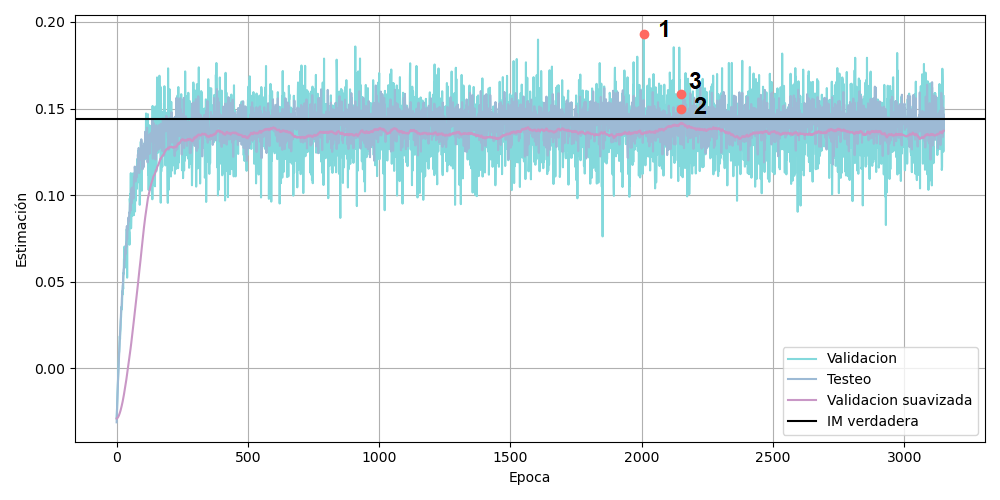

# CodigoMine
En este repositorio se encuentran los códigos de implementación de MINE (Mutual-Information Neural Estimator),
una red neuronal para la estimación de información mutua entre dos señales aleatorias, con la finalidad
de aplicarlo a señales de origen biológico.

### Fundamentación del Método

Hacia el año 2018, Belghazi _et al_. publicaron un artículo en el que proponen un estimador de información
mutua basado en redes neuronales, llamado MINE (Mutual Information Neural Estimator).
Belghazi no propone una arquitectura de red en específica, sino una función a maximizar.
De esta manera, se emplea la red neuronal como un optimizador de funciones. Dicha función
se obtiene a partir de una representación particular de la divergencia de Kullback-Leibler ($D_{KL}$). 
Para ver demostración remitirse al paper de Belghazi _et al_.

|                                                                                                                                 *Teorema 1:* Representación de Donsker-Varadhan de $D_{KL}$                                                                                                                                  |
|:----------------------------------------------------------------------------------------------------------------------------------------------------------------------------------------------------------------------------------------------------------------------------------------------------------------------------:|
| La divergencia de Kulback-Leibler admite la siguiente representación:<br/>$$D_{KL}(p\|q) = \sup\limits_{T:\Omega \to \mathbb{R}} \mathbb{E}_p[T] - \log \left(\mathbb{E}_q\left[e^T\right]\right)$$ <br/>en donde el valor superior se obtiene entre todas las funciones $T$ tal que los dos valores esperados sean finitos. |

Sea $\mathcal{F}$ un subconjunto cualquiera de funciones que mapea elementos según la regla 
$\Omega \to \mathbb{R}$, y tal que se cumplan las condiciones del teorema (1), 
se tiene entonces la cota inferior:

$$D_{KL}(p\|q) \ge \sup\limits_{T\in \mathcal{F}} \mathbb{E}_p[T] - \log (\mathbb{E}_q[e^T])$$

Siendo que la información mutua entre las variables aleatorias $X$ y $Y$ se define como la 
divergencia entre las distribuciones $P_{XY}(x,y)$ y $P_X(x)P_Y(y)$, tenemos:

$$I(X;Y) \ge \sup\limits_ {T\in \mathcal{F}} \mathbb{E}_ {P_ {XY}}[T] - \log (\mathbb{E}_ {P_ X P_ Y}[e^T])$$

El conjunto $\mathcal{F}$ podría ser una familia de funciones 
$T_{\theta}: \mathcal{X} \mathcal{Y} \to \mathbb{R}$ parametrizada por una red neuronal con
parámetros $\theta \in \Theta$. Bajo esta suposición, consideremos el miembro derecho de 
la inecuación anterior como nuestro estimador $I_{\Theta}(X;Y)$.

$$I_{\Theta}(X;Y) \equiv \sup\limits_ {\theta\in \Theta} \mathbb{E}_ {P_ {XY}}[T_ {\theta}] - \log (\mathbb{E}_ {P_ X P_ Y}[e^{T_ {\theta}}])$$

De esta manera, reemplazando el valor del estimador $I_{\Theta}$ en la 
inecuación original, tenemos:

$$I(X;Y) \ge I_{\Theta}(X;Y)$$

Esta expresión nos indica que el estimador $I_{\Theta}(X;Y)$ posee como cota 
superior la información mutua real $I(X;Y)$. De esta manera, mediante una red neuronal buscaremos 
maximizar $I_{\Theta}(X;Y)$, lo cual se logrará mediante exploración en el hiper-espacio de parámetros 
$\Theta$ de la red.

Con esta idea en mente, presentamos la definición de MINE:

|                                                                                                                                                                                                                                       Definición 1: MINE                                                                                                                                                                                                                                        |
|:-----------------------------------------------------------------------------------------------------------------------------------------------------------------------------------------------------------------------------------------------------------------------------------------------------------------------------------------------------------------------------------------------------------------------------------------------------------------------------------------------:|
| Sea $\mathcal{F}=\{ T_ {\theta} \}_ {\theta \in \Theta}$ un conjunto de funciones parametrizadas por una red neuronal. MINE (_Mutual Information Neural Estimator_) se define como: <br/>$$\hat{I}(X;Y)_ {n} = \sup\limits_ {\theta \in \Theta} \mathbb{E}_ {P_ {XY}}\left[T_ \theta\right] - \log \left( \mathbb{E}_ {P_{X} P_{Y}}\left[e^{T_\theta}\right] \right)$$ <br/>En donde $P$ refiere a distribuciones empíricas asociadas a $n$ muestras independientes idénticamente distribuidas. |

Los dos valores esperados que figuran en la definición de MINE se estiman a partir 
de la media de muestras empíricas con distribución $P_{XY}$ y $P_X P_Y$, respectivamente. Las muestras 
obtenidas empíricamente se asumen que poseen una distribución $P_{XY}$. Por otro lado, obtener muestras 
con distribución $P_X P_Y$ es complicado puesto que desconocemos de entrada si $X$ y $Y$ son independientes 
o no. Para generar tales muestras procedemos a barajar las muestras $Y$ de las muestras pareadas de la 
distribución conjunta $P_{XY}$, rompiendo cualquier relación existente entre $X$ y $Y$. 

Reemplazando los valores esperados por valores medios, la expresión a maximizar se convierte en 
una cantidad calculable numéricamente a partir de un conjunto finito de muestras pareadas con 
distribución $P_{XY}$. Dicha expresión se resume en la fórmula de abajo, para un conjunto 
de $b$ muestras pareadas, donde el vector $\bar{\mathbf{y}}$ es una versión permutada del vector de muestras 
original $\mathbf{y}$.

$$\frac{1}{b} \sum\limits_{i=1}^{b}T_\theta(\mathbf{x}_ i,\mathbf{y}_ i) - \log \left[ \frac{1}{b} \sum\limits_{i=1}^{b} e^{T _\theta(\mathbf{x}_i,\bar{\mathbf{y}}_i)} \right]$$

### Indicadores para la estimación
Durante el entrenamiento de la red, se almacena por cada época tres 
indicadores, que nos permiten monitorear el progreso de la red. Éstos son:
* Salida de la red aplicado a los datos de validación (**indicador de validación**)
* Salida de la red aplicado al dataset completo (**indicador de testeo**)
* Indicador de validación suavizado con un _linear moving average_ de 100 pasos
(**indicador de validación suavizado**)

Con estos tres indicadores se trazan las curvas de progreso de la red en
función de las épocas de entrenamiento. A partir de estas curvas, 
definimos tres estimadores de información mutua:
1. **Estimador 1:** el valor más alto del indicador de validación
2. **Estimador 2:** el valor más alto del indicador de testeo
3. **Estimador 3:** el valor del indicador de validación para la posición
en donde el índice de validación filtrada es la mayor.

Vemos a continuación el progreso de entrenamiento de una red
MINE entrenada con un par de señales aleatorias con coeficiente de 
correlación 0.5, con la evolución de los tres indicadores a lo largo
de las épocas, y señalando los tres estimadores que se obtienen a 
partir de los mismos.



### Instalación como Módulo de Python
Para tener `mine` disponible como módulo de python (y poder ser 
importado por un script que quiera hacer uso del método) se deben seguir 
los siguientes pasos:
1. Clonar el presente repositorio a la carpeta de trabajo.
2. Abrir un intérprete de comandos ubicado dentro del repositorio mine
y ejecutar el siguiente código: `pip install -e .` Esto instala el 
repositorio mine como un paquete de Python en la versión de Python por
defecto de la máquina.
3. Desde cualquier script que vaya a ser ejecutado por dicho intérprete
de Python, importar del paquete mine el módulo deseado para trabajar.
Por ejemplo: `from mine import mine2`.

### Código de Ejemplo
A continuación se provee un script para evaluar la información mutua 
entre dos señales aleatorias con distribución gaussiana, con media $\mu=(0,0)$
y coeficiente de correlación $\rho = 0.5$, con 1000 muestras cada una.
```python
from mine.mine2 import Mine2
import numpy as np
import torch

# defino la media
mu = np.array((0,0))
# defino matriz de covarianza
rho = 0.5
cov_matrix = np.array([[1, rho], [rho, 1]])
# Genero la señal
samples = 1000
joint_samples_train = np.random.multivariate_normal(mean=mu, cov=cov_matrix, size=(samples, 1))
X_samples = joint_samples_train[:, :, 0]
Z_samples = joint_samples_train[:, :, 1]
# Convierto a tensores
x = torch.from_numpy(X_samples).float().to(device=CUDA)
z = torch.from_numpy(Z_samples).float().to(device=CUDA)
# Información mutua mediante formula (para distribuciones normales)
true_mi = -0.5 * np.log(np.linalg.det(cov_matrix))
# Instancio la red
red = Mine2(hidden_layers=3, neurons=50, act_func='relu', cuda=CUDA,
            validation_average=100, stop_patience=1000)
# Entreno la red
minibatch_size = int(len(x) * 0.1)  # 10% del dataset original 
red.fit(x, z, train_percent=80, minibatch_size=minibatch_size, learning_rate=1e-3,
        num_epochs=15000, random_partition=True, patience=250, scaling_factor=0.5)
# Obtengo las estimaciones
estimador1, estimador2, estimador3 = red.estimacion_mi()
```

